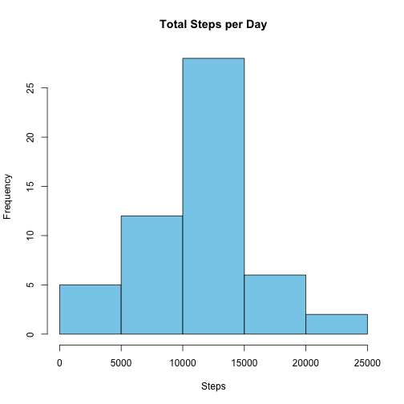
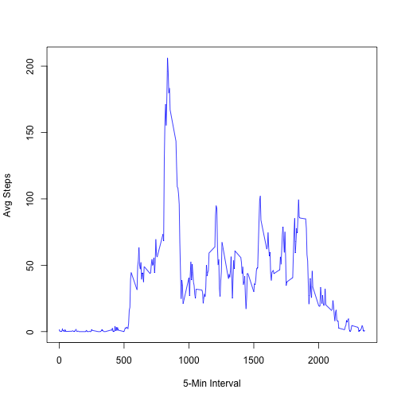
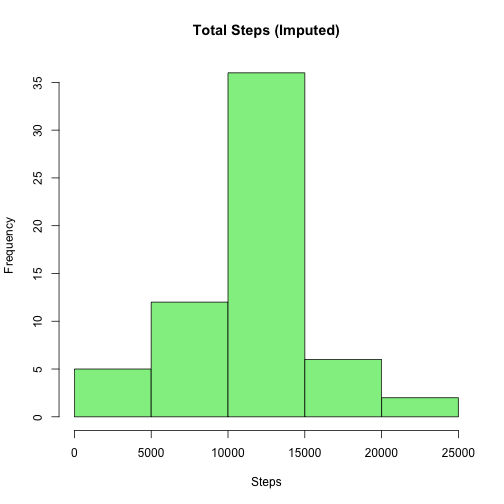
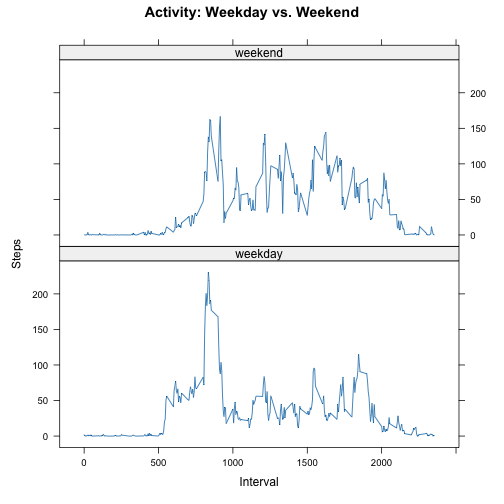

## Loading and preprocessing the data


``` r
activity <- read.csv("activity.csv")
activity$date <- as.Date(activity$date)
```

## What is mean total number of steps taken per day?


``` r
daily_steps <- aggregate(steps ~ date, data = activity, sum, na.rm = TRUE)
hist(daily_steps$steps, main = "Total Steps per Day", xlab = "Steps", col = "skyblue")
```



``` r
mean(daily_steps$steps)
```

```
## [1] 10766.19
```

``` r
median(daily_steps$steps)
```

```
## [1] 10765
```

## What is the average daily activity pattern?


``` r
interval_avg <- aggregate(steps ~ interval, data = activity, mean, na.rm = TRUE)
plot(interval_avg$interval, interval_avg$steps, type = "l", 
     xlab = "5-Min Interval", ylab = "Avg Steps", col = "blue")
```



``` r
max_interval <- interval_avg[which.max(interval_avg$steps), ]
max_interval
```

```
##     interval    steps
## 104      835 206.1698
```

## Imputing missing values


``` r
#1.Missing values are identified:
sum(is.na(activity$steps))
```

```
## [1] 2304
```

``` r
#This checks how many values are missing.
activity_imputed <- activity

#2.Imputation strategy is applied:
for (i in 1:nrow(activity_imputed)) {
    if (is.na(activity_imputed$steps[i])) {
        interval_val <- activity_imputed$interval[i]
        activity_imputed$steps[i] <- interval_avg[interval_avg$interval == interval_val, "steps"]
    }
}
#This loop replaces missing steps values with the mean number of steps for that 5-minute interval — a common and acceptable imputation method

#3.-After imputation, a new histogram is created, and new mean/median values are calculated — which further confirms the changes were implemented:
daily_steps_imputed <- aggregate(steps ~ date, data = activity_imputed, sum)
hist(daily_steps_imputed$steps, main = "Total Steps (Imputed)", xlab = "Steps", col = "lightgreen")
```



``` r
mean_imputed <- mean(daily_steps_imputed$steps)
mean_imputed
```

```
## [1] 10766.19
```

``` r
median_imputed <- median(daily_steps_imputed$steps)
median_imputed
```

```
## [1] 10766.19
```

## Are there differences in activity patterns between weekdays and weekends?


``` r
activity_imputed$day_type <- ifelse(weekdays(activity_imputed$date) %in% c("Saturday", "Sunday"), 
                                   "weekend", "weekday")

avg_daytype <- aggregate(steps ~ interval + day_type, data = activity_imputed, mean)

library(lattice)
xyplot(steps ~ interval | day_type, data = avg_daytype, type = "l", 
       layout = c(1, 2), xlab = "Interval", ylab = "Steps", 
       main = "Activity: Weekday vs. Weekend")
```


